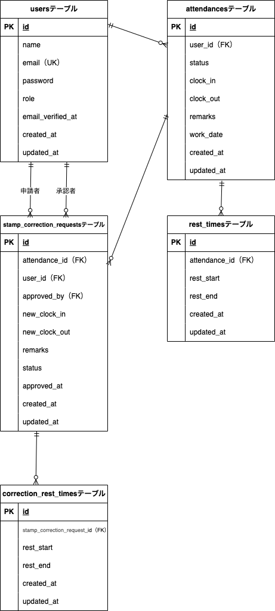

# attendance_management

勤怠管理アプリケーション

## アプリケーション名

coachtech 勤怠管理アプリ

## 環境構築

### 前提条件

- Docker/Docker Composeがインストールされていること
- Gitがインストールされていること

### Dockerビルド

1. リポジトリをクローン

```bash
git clone git@github.com:yyuka2000-collab/attendance_management.git
または
git clone https://github.com/yyuka2000-collab/attendance_management.git

cd attendance_management
```

2. Dockerコンテナをビルド・起動

```bash
docker-compose up -d --build
```

### Laravel環境構築

1. PHPコンテナに入る

```bash
docker-compose exec php bash
```

2. Composerで依存関係をインストール

```bash
composer install
```

3. 環境変数ファイルを作成

```bash
cp .env.example .env
```

`.env`ファイルを開き、以下の項目を環境に合わせて設定してください。

```env
DB_CONNECTION=mysql
DB_HOST=mysql
DB_PORT=3306
DB_DATABASE=laravel_db      # 任意のデータベース名
DB_USERNAME=laravel_user    # MySQLのユーザー名
DB_PASSWORD=laravel_pass    # MySQLのパスワード
```

4. アプリケーションキーを生成

```bash
php artisan key:generate
```

5. マイグレーション＆シーディングを実行

```bash
php artisan migrate:fresh --seed
```

6. ストレージのシンボリックリンク作成

```bash
php artisan storage:link
```

## 使用技術（実行環境）

- **PHP**: 8.1
- **Laravel**: 8.0
- **MySQL**: 8.0.26
- **nginx**: 1.21.1

## ER図



## 仕様

- 打刻し忘れ等で勤怠レコードが存在しない日について、一般ユーザーは修正申請を行うことができない
- その場合は管理者が勤怠詳細画面から直接勤怠情報を作成・修正することで対応する

## 管理者アカウント

シーダーで以下の開発用アカウントが作成されます。

| 項目           | 値                |
| -------------- | ----------------- |
| メールアドレス | admin@example.com |
| パスワード     | adminpassword     |

> **注意**: 本番環境では必ずメールアドレスとパスワードを変更してください。

## 機能一覧

### 認証機能（一般ユーザー）

- 会員登録（Fortify使用）
- ログイン／ログアウト（Fortify使用）
- メール認証機能（応用機能）

### 認証機能（管理者）

- ログイン／ログアウト（admin ガードの都合上、独自コントローラーで実装したが処理は Fortify と同等）

### 打刻機能

- 現在の日時表示
- ステータス表示（勤務外／出勤中／休憩中／退勤済）
- 出勤打刻（1日1回）
- 休憩入打刻（1日複数回可）
- 休憩戻打刻（1日複数回可）
- 退勤打刻（1日1回）

### 勤怠一覧機能（一般ユーザー）

- 自分の月次勤怠一覧表示
- 前月／翌月切り替え
- 勤怠詳細画面への遷移

### 勤怠詳細・修正申請機能（一般ユーザー）

- 勤怠詳細情報表示（名前・日付・出退勤・休憩・備考）
- 出勤・退勤・休憩・備考の編集
- バリデーション機能（FormRequest使用）※要件シートの「機能要件」FN029、FN039に追加で休憩の重複チェックをしています。バリデーションメッセージが「機能要件」と「テストケース一覧」で異なりますが、「機能要件」で作成しています。
- 修正申請送信

### 申請一覧機能（一般ユーザー）

- 承認待ち申請一覧表示
- 承認済み申請一覧表示
- 申請詳細画面への遷移

### 勤怠一覧機能（管理者）

- 全ユーザーの日次勤怠一覧表示
- 前日／翌日切り替え
- 勤怠詳細画面への遷移

### 勤怠詳細・直接修正機能（管理者）

- 勤怠詳細情報表示
- 出勤・退勤・休憩・備考の直接修正
- バリデーション機能（FormRequest使用）※要件シートの「機能要件」FN029、FN039に追加で休憩の重複チェックをしています。バリデーションメッセージが「機能要件」と「テストケース一覧」で異なりますが、「機能要件」で作成しています。

### スタッフ管理機能（管理者）

- スタッフ一覧表示（氏名・メールアドレス）
- スタッフ別月次勤怠一覧表示
- 前月／翌月切り替え
- CSV出力機能

### 修正申請管理機能（管理者）

- 承認待ち申請一覧表示
- 承認済み申請一覧表示
- 申請詳細表示
- 申請承認機能

## URL

### 一般ユーザー

- **打刻画面**: http://localhost/attendance
- **勤怠一覧画面**: http://localhost/attendance/list
- **勤怠詳細画面**: http://localhost/attendance/detail/{id}
- **申請一覧画面**: http://localhost/stamp_correction_request/list
- **会員登録画面**: http://localhost/register
- **ログイン画面**: http://localhost/login
- **メール認証画面**: http://localhost/email/verify

### 管理者

- **管理者ログイン画面**: http://localhost/admin/login
- **勤怠一覧画面（日次）**: http://localhost/admin/attendance/list
- **勤怠詳細画面**: http://localhost/admin/attendance/{id}
- **スタッフ一覧画面**: http://localhost/admin/staff/list
- **スタッフ別月次勤怠一覧**: http://localhost/admin/attendance/staff/{id}
- **修正申請一覧画面**: http://localhost/stamp_correction_request/list
- **修正申請詳細・承認画面**: http://localhost/admin/stamp_correction_request/approve/{id}

### その他

- **phpMyAdmin**: http://localhost:8080/
